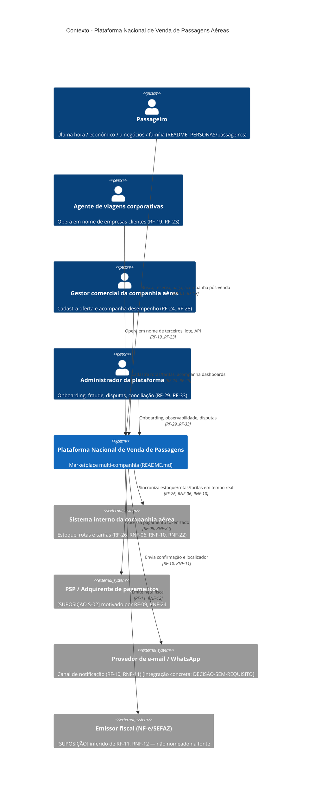
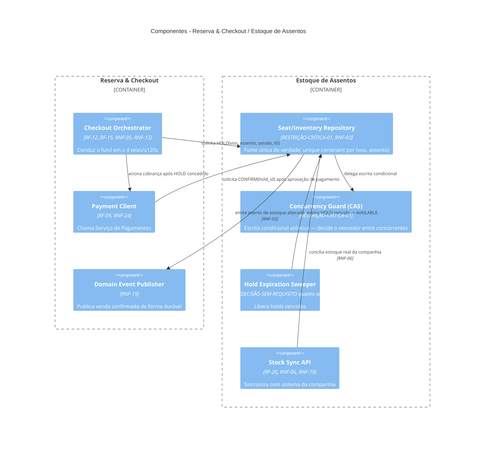
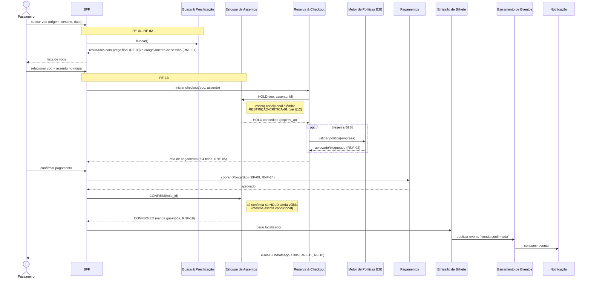
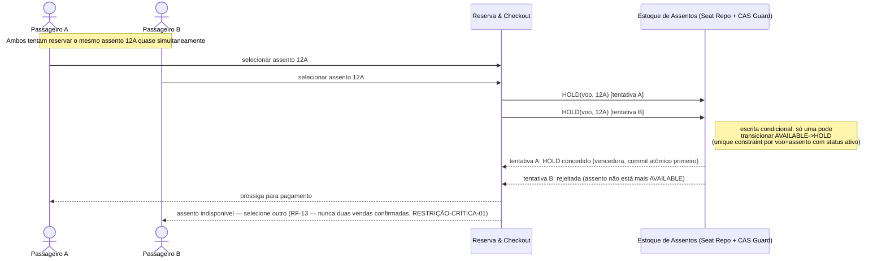
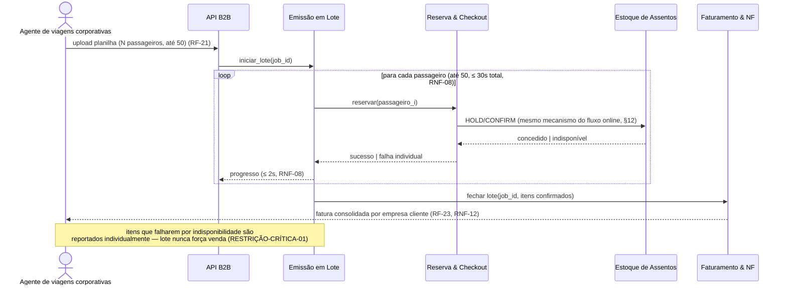
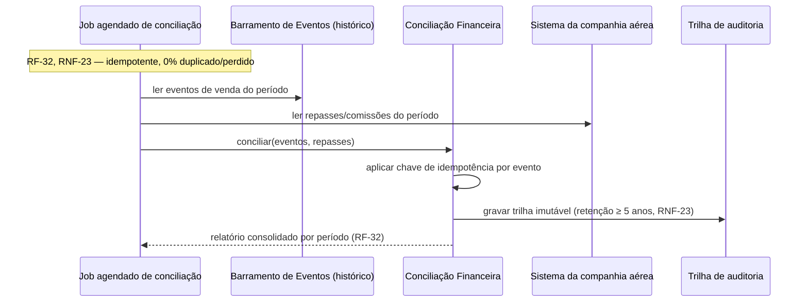
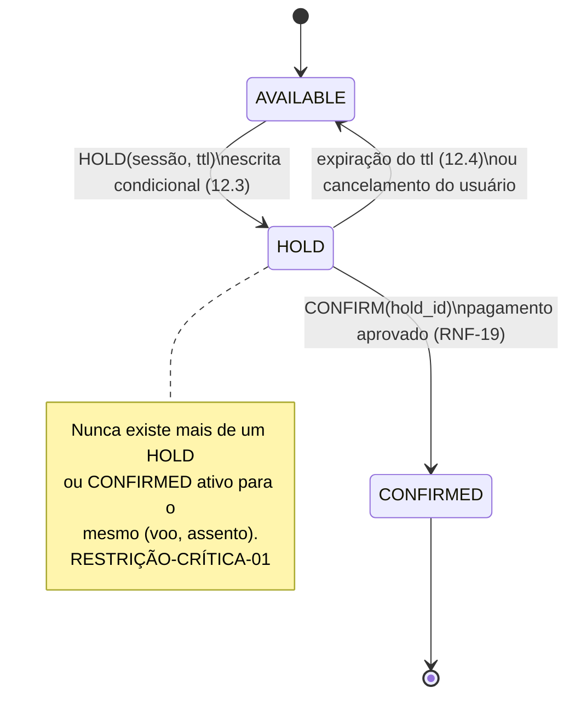

# Arquitetura — Plataforma Nacional de Venda de Passagens Aéreas

> **Escopo desta seção.** Documento de arquitetura derivado **exclusivamente** dos artefatos de requisitos e personas versionados neste repositório. Os artefatos citados são tratados como **única fonte de verdade**. Nada aqui inventa usuários, volumes, tecnologias, SLAs ou regras; toda afirmação é rastreada ao caminho e/ou identificador de origem. Onde a fonte não define algo, o item é registrado explicitamente como **lacuna**, **conflito**, **suposição** ou **pergunta aberta** — nunca preenchido por conta própria.
>
> **Fontes primárias:**
> - [README.md](../README.md) — visão do projeto e catálogo de personas.
> - [REQUISITOS/requisitos-funcionais-e-nao-funcionais.md](../REQUISITOS/requisitos-funcionais-e-nao-funcionais.md) — RF-01…RF-33 e RNF-01…RNF-33.
> - [PERSONAS/passageiros/viajante-ultima-hora.md](../PERSONAS/passageiros/viajante-ultima-hora.md)
> - [PERSONAS/passageiros/viajante-economico.md](../PERSONAS/passageiros/viajante-economico.md)
> - [PERSONAS/passageiros/viajante-a-negocios.md](../PERSONAS/passageiros/viajante-a-negocios.md)
> - [PERSONAS/passageiros/familia-turista-planejadora.md](../PERSONAS/passageiros/familia-turista-planejadora.md)
> - [PERSONAS/companhias-aereas/gestor-comercial-companhia-aerea.md](../PERSONAS/companhias-aereas/gestor-comercial-companhia-aerea.md)
> - [PERSONAS/operacao-interna/administrador-da-plataforma.md](../PERSONAS/operacao-interna/administrador-da-plataforma.md)
> - [PERSONAS/b2b-agencias/agente-de-viagens-corporativas.md](../PERSONAS/b2b-agencias/agente-de-viagens-corporativas.md)

---

## 0. Restrição inegociável (registro obrigatório)

> ### 🔒 RESTRIÇÃO-CRÍTICA-01 — Proibição absoluta de overbooking e de conflito entre passageiros
>
> **De forma alguma a implementação pode permitir overbooking ou conflitos entre passageiros que vão comprar passagens em uma linha aérea.**
>
> - **Natureza:** restrição arquitetural inviolável (hard constraint). Prevalece sobre qualquer meta de desempenho, usabilidade ou conveniência de checkout.
> - **Significado operacional:** dois ou mais passageiros nunca podem adquirir/reservar o mesmo assento; a soma de assentos vendidos/reservados nunca pode exceder o estoque real de assentos do voo/classe; nenhuma condição de corrida no checkout pode resultar em duas vendas confirmadas para o mesmo lugar.
> - **Rastreabilidade nos artefatos:** decorre e é reforçada por
>   [RNF-03](../REQUISITOS/requisitos-funcionais-e-nao-funcionais.md) (divergência máxima de **0 assentos** — zero tolerância — entre estoque exibido e estoque real, reconciliação event-driven em ≤ 2 s após venda),
>   [RF-26](../REQUISITOS/requisitos-funcionais-e-nao-funcionais.md) (sincronização em tempo real de estoque, "prevenindo overbooking"),
>   [RNF-06](../REQUISITOS/requisitos-funcionais-e-nao-funcionais.md) (propagação de estoque em ≤ 2 s P95 / ≤ 5 s P99),
>   [RF-13](../REQUISITOS/requisitos-funcionais-e-nao-funcionais.md) (seleção de assento no mapa),
>   e pelas dores/objetivos do [Gestor comercial da companhia aérea](../PERSONAS/companhias-aereas/gestor-comercial-companhia-aerea.md) ("atrasos na atualização de disponibilidade podem gerar overbooking ou venda de assentos já esgotados"; objetivo: "Garantir que não haja divergência entre o estoque de assentos vendido na plataforma e o sistema interno da companhia (evitar overbooking)").
> - **Implicação arquitetural (a validar, não imposta):** exige um mecanismo de **reserva/garantia de assento com exclusão mútua** (ex.: hold transacional com expiração, verificação de disponibilidade atômica no momento da confirmação) **antes** da coleta/confirmação de pagamento — conforme objetivo do [Viajante de última hora](../PERSONAS/passageiros/viajante-ultima-hora.md): "Ter certeza absoluta da disponibilidade de assento antes de inserir dados de pagamento". O mecanismo concreto é decisão de projeto posterior; aqui registra-se apenas a obrigação de garanti-lo. **Modelo proposto (com alternativas e trade-offs) em [§12](#12-modelo-de-reserva-de-passagem--exclusão-mútua-expiração-e-decisão-de-posse).**

---

## 1. Contexto e objetivo

### 1.1 Fatos (extraídos da fonte)

- **Objetivo do produto** ([README.md](../README.md), linha 4): "criar uma plataforma nacional integrada com várias companhias aéreas parceiras que vão fazer oferta e venda de passagens, podendo oferecer pacotes, ofertas, compatibilidade com empresas para serviço B2B, entre outros fatores relevantes para otimização de compra e recursos para diversas personas de cliente final."
- **Modelo de negócio:** marketplace multi-parceiro (múltiplas companhias aéreas parceiras) com venda ao consumidor final e canal B2B para agências — evidenciado por [README.md](../README.md) e pelas seções 3.4 (B2B), 3.5 (companhias) e 3.6 (operação interna) de [REQUISITOS](../REQUISITOS/requisitos-funcionais-e-nao-funcionais.md).
- **Abrangência:** "nacional" ([README.md](../README.md)); todas as rotas citadas nas personas são domésticas no Brasil (ex.: BH→SP, SP→Recife, Fortaleza→Belém, viagem a Salvador).
- **Natureza multi-tenant:** a plataforma segrega dados por companhia aérea parceira e por empresa cliente de agência ([RNF-27](../REQUISITOS/requisitos-funcionais-e-nao-funcionais.md): "0% de vazamento de dados cross-tenant"; [RF-20](../REQUISITOS/requisitos-funcionais-e-nao-funcionais.md): políticas por empresa cliente).
- **Canais de acesso:** app mobile (iOS/Android) e web ([RNF-32](../REQUISITOS/requisitos-funcionais-e-nao-funcionais.md), [RNF-18](../REQUISITOS/requisitos-funcionais-e-nao-funcionais.md)); API para parceiros e agências ([RF-22](../REQUISITOS/requisitos-funcionais-e-nao-funcionais.md), [RNF-09](../REQUISITOS/requisitos-funcionais-e-nao-funcionais.md)); painéis administrativos para companhias e operação interna ([RF-24](../REQUISITOS/requisitos-funcionais-e-nao-funcionais.md), [RF-30](../REQUISITOS/requisitos-funcionais-e-nao-funcionais.md)).

### 1.2 Objetivo desta seção de arquitetura

Estabelecer a base arquiteturalmente significativa (drivers, atributos de qualidade, restrições e riscos) para o projeto, ancorada nos requisitos elicitados, servindo de referência para decisões de projeto subsequentes — sem antecipar escolhas de tecnologia não presentes na fonte.

---

## 2. Stakeholders / Personas

Todas as personas abaixo constam de [README.md](../README.md) (linhas 8–21) e da tabela de atores em [REQUISITOS §2](../REQUISITOS/requisitos-funcionais-e-nao-funcionais.md). Nomes fictícios são os definidos nos próprios arquivos de persona.

| Categoria | Persona (arquivo) | Nome na fonte | Papel-chave | Requisitos vinculados (rastreabilidade §5 do REQUISITOS) |
|---|---|---|---|---|
| Passageiro | [Viajante de última hora](../PERSONAS/passageiros/viajante-ultima-hora.md) | Marcos Vinícius Souza | Compra sob urgência (< 24h), foco em velocidade e certeza de assento | RF-01, RF-04, RF-07, RF-10, RF-16; RNF-04, RNF-05, RNF-13, RNF-19, RNF-20, RNF-21, RNF-24 |
| Passageiro | [Viajante econômico](../PERSONAS/passageiros/viajante-economico.md) | Jéssica Almeida | Sensível a preço, flexível em datas, transparência total de preço | RF-02, RF-03, RF-06, RF-09, RF-14; RNF-01, RNF-14, RNF-15 |
| Passageiro | [Viajante a negócios](../PERSONAS/passageiros/viajante-a-negocios.md) | Carlos Mendes | Compra rápida, nota fiscal, remarcação flexível, fidelidade | RF-04, RF-05, RF-07, RF-08, RF-09, RF-11, RF-17; RNF-05, RNF-24 |
| Passageiro | [Família/turista planejadora](../PERSONAS/passageiros/familia-turista-planejadora.md) | Renata e Fábio Oliveira (+2 crianças) | Compra em grupo, assentos juntos, parcelamento, documentação de menores | RF-02, RF-03, RF-09, RF-12, RF-13, RF-14, RF-15; RNF-01, RNF-14, RNF-17, RNF-25 |
| Operação interna | [Administrador da plataforma](../PERSONAS/operacao-interna/administrador-da-plataforma.md) | Beatriz Lima | Onboarding de parceiros, fraude, disputas, conciliação financeira | RF-29, RF-30, RF-31, RF-32, RF-33; RNF-23, RNF-26, RNF-29 |
| Companhia aérea | [Gestor comercial da companhia aérea](../PERSONAS/companhias-aereas/gestor-comercial-companhia-aerea.md) | Rodrigo Farias | Cadastro de rotas/tarifas, promoções, estoque de assentos, dashboards | RF-24, RF-25, RF-26, RF-27, RF-28, RF-29; RNF-03, RNF-06, RNF-07, RNF-10, RNF-16, RNF-22, RNF-27, RNF-31, RNF-33 |
| Agência B2B | [Agente de viagens corporativas](../PERSONAS/b2b-agencias/agente-de-viagens-corporativas.md) | Patrícia Nogueira | Compra em nome de terceiros, políticas por empresa, lote, fatura consolidada, API | RF-19, RF-20, RF-21, RF-22, RF-23; RNF-02, RNF-08, RNF-09, RNF-17, RNF-27, RNF-28, RNF-30, RNF-33 |

> **Nota de rastreabilidade (conflito menor registrado):** a tabela §5 de [REQUISITOS](../REQUISITOS/requisitos-funcionais-e-nao-funcionais.md) atribui à "Administradora da plataforma" os requisitos **RF-29 a RF-33** e ao "Agente de viagens corporativas" o **RF-18**. Porém, pelo texto dos próprios requisitos, **RF-30/RF-31** (políticas de viagem B2B e publicação de tarifa) e **RF-18** (notificação de alteração de voo) têm origem declarada em outras personas. Ver [§8 Conflitos](#82-conflitos).

**Stakeholders não personificados, mas citados na fonte** (não têm arquivo de persona; tratados como partes interessadas):
- **Time de produto/engenharia da plataforma** — citado em [administrador-da-plataforma.md](../PERSONAS/operacao-interna/administrador-da-plataforma.md) ("meio de campo entre passageiros, companhias aéreas e o time de produto/engenharia").
- **Time de revenue management e TI da própria companhia aérea** — citados em [gestor-comercial-companhia-aerea.md](../PERSONAS/companhias-aereas/gestor-comercial-companhia-aerea.md).
- **Empresas clientes das agências** (beneficiários das viagens) — citadas em [agente-de-viagens-corporativas.md](../PERSONAS/b2b-agencias/agente-de-viagens-corporativas.md).

---

## 3. Requisitos arquiteturalmente significativos (ASR)

Selecionados por impacto estrutural (integração, consistência de dados, multi-tenant, desempenho crítico, conformidade). Cada ASR cita seus IDs de origem.

| ASR | Descrição | Requisitos de origem | Por que é arquitetural |
|---|---|---|---|
| **ASR-01 — Consistência de estoque sem overbooking** | Estoque de assentos com **zero divergência**, sincronizado em tempo real com o sistema de cada companhia; garantia de unicidade de assento na venda. | RESTRIÇÃO-CRÍTICA-01, RF-26, RF-13, RNF-03, RNF-06, RNF-10, RNF-22 | Exige modelo de consistência forte no ato de reserva, integração event-driven e tratamento de concorrência. |
| **ASR-02 — Integração multi-companhia em tempo real** | Sincronização de estoque, rotas, tarifas e promoções entre N companhias parceiras e a plataforma. | RF-24, RF-25, RF-26, RNF-06, RNF-10, RNF-33 | Define fronteiras de integração, contratos de API, versionamento e resiliência a falhas de parceiro. |
| **ASR-03 — Multi-tenant com isolamento estrito** | Isolamento de dados entre companhias e entre empresas clientes de agências; RBAC. | RF-19, RF-20, RNF-27, RNF-28 | Modelo de dados, autorização e auditoria com garantia de 0% de vazamento cross-tenant. |
| **ASR-04 — Precificação transparente e íntegra** | Preço final (taxas + bagagem) exibido na busca com **0% de divergência** frente ao checkout, respeitada tarifa dinâmica sinalizada. | RF-03, RF-14, RNF-01, RNF-14 | Define pipeline de precificação, cache/atualização de tarifa e ponto de "congelamento" de preço. |
| **ASR-05 — Checkout de baixa fricção e alta confiabilidade** | Checkout ≤ 120 s, ≤ 4 etapas, com dados salvos; nenhuma reserva paga perdida. | RF-07, RF-08, RF-12, RNF-05, RNF-13, RNF-19 | Trade-off entre velocidade de checkout e garantias transacionais (ASR-01/ASR-04). |
| **ASR-06 — Pagamentos multi-meio conformes a PCI-DSS** | Pix, cartão com parcelamento; tokenização; nenhum PAN em texto claro. | RF-09, RNF-24 | Fronteira de conformidade, tokenização e integração com adquirentes/PSP. |
| **ASR-07 — Notificação multicanal orientada a evento** | E-mail + WhatsApp ≤ 30 s do evento; notificação de alteração/cancelamento de voo. | RF-10, RF-18, RNF-11 | Barramento de eventos e integração com provedores de mensageria. |
| **ASR-08 — Faturamento, conciliação e nota fiscal** | Nota fiscal individual ≤ 60 s; fatura B2B consolidada; conciliação idempotente com trilha de auditoria ≥ 5 anos. | RF-11, RF-23, RF-32, RNF-12, RNF-23 | Idempotência financeira, retenção de longo prazo e integração fiscal. |
| **ASR-09 — Operação em lote B2B e API pública** | Emissão em lote (até 50 passageiros ≤ 30 s), API OpenAPI 3.0, OAuth2, versionada. | RF-21, RF-22, RNF-08, RNF-09, RNF-28, RNF-33 | Processamento assíncrono/em lote e contrato público estável. |
| **ASR-10 — Motor de políticas de viagem B2B** | Aplicação automática de política por empresa cliente; bloqueio de 100% das reservas fora de política. | RF-20, RNF-02, RNF-30 | Regras configuráveis sem deploy, aplicadas em tempo de busca/reserva. |
| **ASR-11 — Observabilidade e antifraude da operação** | Painel unificado de saúde; alertas de anomalia; conciliação. | RF-30, RF-31, RF-32, RF-33, RNF-07, RNF-23, RNF-26 | Coleta/agregação de métricas cross-tenant e detecção de anomalias. |
| **ASR-12 — Onboarding padronizado de parceiros** | Fluxo padronizado de homologação técnica ≤ 10 dias úteis. | RF-29, RNF-29 | Padroniza integração técnica e reduz variabilidade de parceiros. |

---

## 4. Atributos de qualidade (ISO/IEC 25010)

Consolidados de [REQUISITOS §4](../REQUISITOS/requisitos-funcionais-e-nao-funcionais.md), que organiza os RNF nos 8 eixos da ISO/IEC 25010. **Métricas marcadas na fonte como `[baseline sugerida]` não são fatos elicitados** e aparecem aqui como **suposições a validar** (ver [§8.3](#83-suposicoes)).

| Eixo (25010) | Requisitos | Metas-chave (verbatim da fonte) |
|---|---|---|
| Adequação funcional | RNF-01, RNF-02, RNF-03 | Divergência de preço busca↔checkout **0%**; bloqueio de **100%** de reservas fora de política (falso-negativo ≤ 0,1%/mês); divergência de estoque **0 assentos**, reconciliação ≤ 2 s. |
| Eficiência de desempenho | RNF-04*, RNF-05, RNF-06, RNF-07*, RNF-08* | Busca ≤ 3 s P95 / ≤ 5 s P99, ≥ 500 buscas simultâneas*; checkout ≤ 120 s / ≤ 4 telas; estoque ≤ 2 s P95 / ≤ 5 s P99; dashboards ≤ 4 s*; lote ≤ 50 passageiros/30 s*. |
| Compatibilidade | RNF-09, RNF-10, RNF-11, RNF-12 | API B2B ≥ 99,9%/mês, ≤ 500 ms P95, OpenAPI 3.0; webhooks 3 tentativas (backoff 1s/5s/30s, timeout 10 s); notificações ≤ 30 s em ≥ 99%; NF ≤ 60 s / fatura B2B até 1º dia útil. |
| Usabilidade | RNF-13, RNF-14, RNF-15, RNF-16*, RNF-17, RNF-18 | Checkout ≤ 3 toques; preço total visível (fonte ≥ 90%), diferença 0%; ≤ 3 upsells, nenhum pré-marcado (opt-in); cadastro de tarifa ≤ 5 min, SUS ≥ 70*; reuso ≥ 70% de campos; responsivo 360–1920px, LCP ≤ 2,5 s. |
| Confiabilidade | RNF-19, RNF-20, RNF-21*, RNF-22*, RNF-23 | 0 perda de reserva paga, confirmação ≤ 5 s; disponibilidade busca/checkout ≥ 99,9%/mês; suporte 24/7/365 (1ª resposta ≤ 2 min*); RTO ≤ 5 min / RPO ≤ 1 min*; conciliação idempotente, auditoria ≥ 5 anos. |
| Segurança | RNF-24, RNF-25, RNF-26, RNF-27, RNF-28 | PCI-DSS, 100% tokenizado; LGPD, exclusão ≤ 15 dias; alerta de fraude ≤ 15 min; RBAC 0% cross-tenant, auditoria trimestral; OAuth2, token ≤ 1h, logs ≥ 5 anos. |
| Manutenibilidade | RNF-29*, RNF-30, RNF-31 | Onboarding técnico ≤ 10 dias úteis*; política B2B por config (sem deploy) ≤ 5 min; publicação de tarifa ≤ 1 min sem time técnico. |
| Portabilidade | RNF-32, RNF-33 | Últimas 2 majors de iOS/Android e últimas 2 versões de Chrome/Safari/Edge; APIs versionadas, compatibilidade retroativa ≥ 12 meses. |

`*` = contém valor marcado como `[baseline sugerida]` na fonte.

---

## 5. Drivers priorizados

Priorização derivada da criticidade declarada nos artefatos: a restrição inegociável e as metas de **zero tolerância** (0% / 0 assentos / 0 perdas) recebem prioridade máxima; metas com valor exato mas sem "zero tolerância" vêm em seguida; itens com `[baseline sugerida]` são os de menor firmeza por dependerem de validação.

| Prioridade | Driver | Ancoragem na fonte | Justificativa da ordem |
|---|---|---|---|
| **P0 — Inegociável** | Não permitir overbooking nem conflito entre passageiros | RESTRIÇÃO-CRÍTICA-01, RNF-03, RF-26, RF-13 | Restrição explícita e absoluta; "zero tolerância" de divergência de estoque. |
| **P0 — Inegociável** | Integridade financeira e de reserva (0 perda de reserva paga; conciliação idempotente) | RNF-19, RNF-23 | Metas de **0** casos/duplicidades; perda de reserva paga é falha inaceitável. |
| **P0 — Inegociável** | Isolamento cross-tenant (0% de vazamento) | RNF-27 | Meta de **0%** validada por auditoria; risco legal/comercial. |
| **P1 — Alta** | Transparência de preço (0% de divergência busca↔checkout) | RNF-01, RNF-14, RF-03 | Dor central de 2 personas; meta de 0% de divergência. |
| **P1 — Alta** | Conformidade PCI-DSS e LGPD | RNF-24, RNF-25 | Conformidade regulatória obrigatória; dados de menores. |
| **P1 — Alta** | Aplicação de política de viagem B2B (bloqueio de 100% fora de política) | RNF-02, RF-20 | Meta de 100%; erro gera retrabalho financeiro. |
| **P1 — Alta** | Disponibilidade de busca/checkout e API (≥ 99,9%/mês) | RNF-20, RNF-09 | Viagens de emergência e integração de parceiros dependem disso. |
| **P2 — Média** | Desempenho de busca e checkout | RNF-04*, RNF-05, RNF-13 | Metas explícitas; RNF-04 tem componente `[baseline sugerida]`. |
| **P2 — Média** | Notificação multicanal e emissão fiscal tempestiva | RNF-11, RNF-12, RF-10 | Metas exatas; reduzem ansiedade e retrabalho. |
| **P2 — Média** | Publicação self-service de tarifas/políticas | RNF-30, RNF-31, RF-24, RF-25 | Autonomia operacional dos parceiros. |
| **P3 — A validar** | Metas com `[baseline sugerida]` (capacidade, dashboards, lote, SUS, RTO/RPO, onboarding, suporte) | RNF-04, RNF-07, RNF-08, RNF-16, RNF-21, RNF-22, RNF-29 | A própria fonte marca como valores a validar com stakeholders. |

> A priorização acima é **derivada** da linguagem de criticidade dos artefatos (restrição explícita, metas de "zero", marcações `[baseline sugerida]`). A ordenação relativa dentro de cada faixa é uma leitura de engenharia e deve ser **confirmada com os stakeholders** — ver [§8.5](#85-perguntas-abertas).

---

## 6. Glossário

Termos definidos ou usados nos artefatos-fonte.

| Termo | Definição (conforme uso na fonte) | Origem |
|---|---|---|
| **Overbooking** | Venda/reserva de mais assentos do que os efetivamente disponíveis; risco a ser prevenido de forma absoluta. | RESTRIÇÃO-CRÍTICA-01, RF-26, [gestor-comercial](../PERSONAS/companhias-aereas/gestor-comercial-companhia-aerea.md) |
| **Marketplace** | Plataforma que integra múltiplas companhias aéreas parceiras ofertando e vendendo passagens ao consumidor e a agências. | [README.md](../README.md), [gestor-comercial](../PERSONAS/companhias-aereas/gestor-comercial-companhia-aerea.md) |
| **Estoque de assentos** | Quantidade real de assentos disponíveis por voo/classe, sincronizada com o sistema da companhia; divergência tolerada = 0. | RNF-03, RNF-06, RF-26 |
| **Tarifa dinâmica** | Variação de preço permitida, limitada a atualizações a cada ≥ 5 minutos e sinalizada ao usuário antes da confirmação. | RNF-01 |
| **Política de viagem (B2B)** | Regras por empresa cliente (classe permitida, teto de gasto por trecho, companhias credenciadas) aplicadas automaticamente. | RF-20, [agente-b2b](../PERSONAS/b2b-agencias/agente-de-viagens-corporativas.md) |
| **Emissão em lote** | Emissão de passagens para múltiplos passageiros a partir de lista/planilha (cenário: 8 passageiros; baseline técnica: até 50). | RF-21, RNF-08 |
| **Faturamento consolidado** | Fatura/nota única por empresa cliente, agregando múltiplas reservas. | RF-23, RNF-12 |
| **Localizador** | Código de confirmação da compra enviado ao passageiro por e-mail/WhatsApp. | RF-10, [viajante-ultima-hora](../PERSONAS/passageiros/viajante-ultima-hora.md) |
| **Calendário de preços** | Visualização de preços em torno da data pesquisada (±15 dias, mín.). | RF-02, [viajante-economico](../PERSONAS/passageiros/viajante-economico.md) |
| **Add-on / upsell** | Ofertas adicionais (bagagem extra, seguro, assento) — máx. 3, sem pré-seleção (opt-in). | RF-14, RNF-15 |
| **Conciliação financeira** | Reconciliação de repasses e comissões entre plataforma e companhias; idempotente, sem duplicidade/perda. | RF-32, RNF-23 |
| **Cross-tenant** | Acesso indevido a dados de outra companhia/agência; meta de vazamento = 0%. | RNF-27 |
| **Onboarding (de parceiro)** | Fluxo padronizado de documentação, integração técnica e homologação de nova companhia. | RF-29, RNF-29 |
| **RBAC** | Controle de acesso baseado em papéis. | RNF-27 |
| **RTO / RPO** | Tempo de recuperação / perda máxima de dados aceitável em falha de sincronização de estoque. | RNF-22 |
| **P95 / P99** | Percentis de latência usados nas metas de desempenho. | RNF-04, RNF-06, RNF-09 |
| **SUS** | System Usability Scale, usada como meta de usabilidade (≥ 70). | RNF-16 |
| **LCP** | Largest Contentful Paint, métrica de carregamento (≤ 2,5 s em 4G). | RNF-18 |
| **GDS** | Sistemas de distribuição/reserva usados pelas agências (contexto de integração). | [agente-b2b](../PERSONAS/b2b-agencias/agente-de-viagens-corporativas.md), RNF-33 |
| **PSP / adquirente** | *(termo não presente na fonte)* — inferência de contexto de pagamentos; **suposição**, ver [§8.3](#83-suposicoes). | — |

---

## 7. Riscos iniciais

| ID | Risco | Origem/ancoragem | Impacto | Mitigação sugerida (a validar) |
|---|---|---|---|---|
| RSK-01 | **Overbooking / conflito de assento** por condição de corrida no checkout ou atraso de sincronização. | RESTRIÇÃO-CRÍTICA-01, RNF-03, RNF-06, [gestor-comercial](../PERSONAS/companhias-aereas/gestor-comercial-companhia-aerea.md) | Crítico — viola restrição inegociável. | Reserva atômica de assento com hold/expiração antes do pagamento; verificação de disponibilidade no commit; reconciliação event-driven. |
| RSK-02 | **Tensão entre checkout ultrarrápido (≤ 120 s) e garantias transacionais** de estoque/pagamento. | RNF-05, RNF-13 vs. RNF-03, RNF-19 | Alto | Definir ponto de garantia de assento e "congelamento" de preço antes da coleta de pagamento. |
| RSK-03 | **Divergência de preço** por tarifa dinâmica entre busca e checkout. | RNF-01, RF-03 | Alto — quebra de confiança. | Congelar preço na sessão; sinalizar atualização (≥ 5 min) antes de confirmar. |
| RSK-04 | **Falha/latência de parceiro** na sincronização de estoque/tarifas. | RNF-06, RNF-10, RNF-22 | Alto | Webhooks com retry/backoff; RTO/RPO definidos; degradação segura que nunca gere overbooking. |
| RSK-05 | **Vazamento cross-tenant** entre companhias/empresas clientes. | RNF-27, RF-19, RF-20 | Alto — legal/comercial. | RBAC, isolamento de dados, auditoria trimestral. |
| RSK-06 | **Não conformidade PCI-DSS / LGPD** (inclui dados de menores). | RNF-24, RNF-25, RF-15 | Alto — regulatório. | Tokenização, minimização de dados, fluxo de exclusão ≤ 15 dias. |
| RSK-07 | **Erros de conciliação financeira** (duplicidade/perda de lançamentos). | RNF-23, RF-32 | Alto | Idempotência, trilha de auditoria imutável ≥ 5 anos. |
| RSK-08 | **Falso-negativo em política de viagem B2B** (reserva fora de política passa). | RNF-02, RF-20 | Médio-alto | Motor de políticas com bloqueio em busca e no commit; meta ≤ 0,1%/mês. |
| RSK-09 | **Metas de capacidade/desempenho não confirmadas** (`[baseline sugerida]`). | RNF-04, RNF-07, RNF-08, RNF-16, RNF-21, RNF-22, RNF-29 | Médio | Validar volumes reais com stakeholders antes de dimensionar. |
| RSK-10 | **Lacunas regulatórias de aviação civil (ANAC)** não detalhadas. | [REQUISITOS §6](../REQUISITOS/requisitos-funcionais-e-nao-funcionais.md) | Médio | Levantar restrições ANAC em refinamento. |
| RSK-11 | **Ausência de dados quantitativos de negócio** (volumes globais, nº de parceiros, transações/mês). | Ver [§8.1](#81-lacunas) | Médio | Elicitar com stakeholders para dimensionamento e priorização. |

---

## 8. Fatos, lacunas, conflitos, suposições e perguntas abertas

### 8.1 Lacunas
*(Ausências na fonte — não preenchidas.)*

- **L-01 — Tecnologias não especificadas.** Nenhum artefato define linguagem, framework, banco de dados, nuvem, mensageria ou stack. Não inventadas neste documento.
- **L-02 — Volumes globais ausentes.** Não há número total de usuários, de companhias parceiras, de agências, nem de transações/dia da plataforma. Só existem números por persona (ex.: agente gerencia 15–30 reservas/semana; família 4 passageiros; lote de 8/até 50). RNF-04 cita "≥ 500 buscas simultâneas" como `[baseline sugerida]`.
- **L-03 — SLAs contratuais com companhias** citados como existentes ([administrador](../PERSONAS/operacao-interna/administrador-da-plataforma.md): "SLA acordado em contrato"; RF-33) mas **valores não definidos**.
- **L-04 — Regras de negócio de tarifa** (multas de remarcação/cancelamento, regras de meia-passagem/criança, bagagem) são citadas como exibíveis (RF-05, RF-14, RF-15, RF-17) mas os **valores/regras concretos não são especificados** — dependem de cada companhia/tarifa.
- **L-05 — Requisitos ANAC** explicitamente fora do escopo do documento de requisitos ([REQUISITOS §6](../REQUISITOS/requisitos-funcionais-e-nao-funcionais.md)).
- **L-06 — Ausência de "decisões anteriores" registradas.** Não há ADRs nem documento de decisões arquiteturais no repositório além de README e requisitos; este é o primeiro artefato de arquitetura.
- **L-07 — Ciclo de vida de reserva/hold** (tempo de expiração da reserva de assento antes do pagamento) não definido — parâmetro necessário para atender RESTRIÇÃO-CRÍTICA-01 sem prejudicar RNF-05.
- **L-08 — Modelo de pacotes** ("pacotes, ofertas" em [README.md](../README.md)) mencionado no objetivo, mas **sem requisito funcional detalhado** correspondente (RF só cobrem passagens, add-ons e promoções).

### 8.2 Conflitos
*(Inconsistências internas entre artefatos — registradas, não resolvidas.)*

- **C-01 — Atribuição de origem divergente na tabela de rastreabilidade.** Em [REQUISITOS §5](../REQUISITOS/requisitos-funcionais-e-nao-funcionais.md):
  - **RF-18** (notificação de alteração/cancelamento de voo) é listado sob "Agente de viagens corporativas" na §5, mas na §3.3 sua **origem declarada** é o Agente de viagens corporativas — porém a linha da persona na §5 lista "RF-18" para o agente **e** o texto do RF-18 também menciona o passageiro. A linha do agente na §5 inclui RF-18, enquanto as demais colunas do agente vão de RF-19 a RF-23. Divergência de agrupamento a confirmar.
  - **RF-30 e RF-31** aparecem na §5 sob "Administradora da plataforma", mas suas **origens declaradas** nas §3.4/§3.5 são, respectivamente, o **Agente de viagens corporativas** (RF-30, política B2B) e o **Gestor comercial** (RF-31, publicação de tarifa). Há inconsistência entre a coluna "Origem" dos requisitos e a tabela de rastreabilidade §5.
- **C-02 — RNF-01 vs. RNF-14 sobre divergência de preço.** Ambos exigem **0%** de divergência busca↔checkout, mas **RNF-01** admite "variação de tarifa dinâmica (atualizações a cada ≥ 5 min) sinalizada antes da confirmação", enquanto **RNF-14** afirma "Diferença entre preço anunciado na busca e preço final no checkout: **0%**" sem ressalva. Necessário harmonizar a exceção de tarifa dinâmica.
- **C-03 — Tensão de metas (não é contradição lógica, mas conflito de trade-off):** checkout ≤ 120 s / ≤ 3 toques (RNF-05, RNF-13) versus garantias de reserva atômica de assento e congelamento de preço (RNF-03, RNF-01). Registrado como RSK-02.

### 8.3 Suposições
*(Não afirmadas na fonte; exigem validação. Nenhuma foi usada para alterar requisitos.)*

- **S-01 — Valores `[baseline sugerida]` não são fatos.** Todos os valores assim marcados em [REQUISITOS §4](../REQUISITOS/requisitos-funcionais-e-nao-funcionais.md) (RNF-04, RNF-07, RNF-08, RNF-16, RNF-21, RNF-22, RNF-29) são pontos de partida a validar, conforme a própria nota da §4.
- **S-02 — Termos de mercado não presentes na fonte** (ex.: "PSP", "adquirente", "barramento de eventos") foram usados apenas como vocabulário de contexto arquitetural, **não** como decisões nem como fatos elicitados.
- **S-03 — Escopo doméstico (Brasil).** Inferido de "nacional" ([README.md](../README.md)) e de todas as rotas citadas serem domésticas; não há afirmação explícita de que rotas internacionais estejam fora de escopo.
- **S-04 — Implicação de "reserva antes do pagamento".** A necessidade de garantir assento antes de coletar pagamento é inferida do objetivo do [viajante de última hora](../PERSONAS/passageiros/viajante-ultima-hora.md) combinado a RNF-03; o mecanismo concreto não está na fonte.

### 8.4 Fatos
*(Consolidação — todos rastreados acima.)* Os fatos deste documento estão nas seções §1.1, §2 (tabela de personas/requisitos), §3, §4 e §6, cada um com citação de caminho e/ou ID. A restrição de §0 é o fato normativo de maior peso.

### 8.5 Perguntas abertas
*(Direcionadas aos stakeholders para refinamento.)*

1. Quais são os **volumes reais** (usuários, companhias parceiras, agências, transações/dia) para dimensionar RNF-04/RNF-07/RNF-08? (L-02, RSK-11)
2. Qual o **tempo de expiração do hold de assento** aceitável entre reserva e pagamento, conciliando RESTRIÇÃO-CRÍTICA-01 com RNF-05? (L-07, RSK-02)
3. Como **harmonizar RNF-01 e RNF-14** quanto à exceção de tarifa dinâmica? (C-02)
4. Confirmar as **atribuições de origem** de RF-18, RF-30 e RF-31 na tabela §5. (C-01)
5. Quais **SLAs contratuais** concretos com companhias regem RF-33/RNF-22? (L-03)
6. O objetivo de **"pacotes/ofertas"** ([README.md](../README.md)) está no escopo desta fase? Não há RF correspondente. (L-08)
7. Quais **restrições regulatórias (ANAC)** devem ser incorporadas como requisitos? (L-05, RSK-10)
8. As **rotas internacionais** estão fora de escopo? (S-03)

---

## 9. Responsabilidades, limites e interfaces dos componentes

> **Nota sobre natureza desta seção.** Nenhuma tecnologia, framework ou produto é definido aqui (mantém-se a lacuna **L-01**). Os "componentes" abaixo são **fronteiras lógicas de responsabilidade** inferidas dos RF/RNF para permitir a modelagem C4 e de sequência das seções seguintes — cada um é rotulado **[REQ]** quando decorre diretamente de um requisito, ou **[DECISÃO-SEM-REQUISITO]** quando é uma escolha de decomposição de projeto sem RF/RNF que a exija literalmente (a fonte não define arquitetura de solução, apenas comportamento observável).

| Componente | Responsabilidade | Não faz (limite) | Interfaces (entrada / saída) | Base |
|---|---|---|---|---|
| **App Web / App Mobile (canal do passageiro)** | Apresentar busca, checkout, pós-venda ao passageiro. | Não decide preço nem disponibilidade — apenas exibe o que os serviços de back-end retornam. | Entrada: interação do usuário. Saída: chamadas ao BFF/API. | RNF-18, RNF-32 [REQ] |
| **Painel Admin Companhia** | Cadastro de rotas/tarifas/promoções (RF-24, RF-25), dashboards de desempenho (RF-27) e posicionamento competitivo (RF-28). | Não altera estoque diretamente sem passar pelo Serviço de Estoque (fonte única de verdade do assento). | Entrada: gestor comercial. Saída: chamadas a Catálogo e a Estoque. | RF-24..RF-28 [REQ] |
| **Painel Admin Interno (operação/plataforma)** | Onboarding de parceiros (RF-29), observabilidade de saúde/fraude (RF-30, RF-31), conciliação (RF-32) e mediação de disputas (RF-33). | Não processa pagamento nem emite bilhete. | Entrada: administrador. Saída: consultas agregadas a todos os demais serviços. | RF-29..RF-33 [REQ] |
| **API B2B pública (agências)** | Expor busca e reserva programáticas (RF-22), versionada (RNF-33), autenticada via OAuth2 (RNF-28). | Não contém lógica de negócio própria — delega a Busca, Políticas e Reserva. | Entrada: sistemas da agência/GDS. Saída: chamadas internas equivalentes ao BFF do passageiro. | RF-22, RNF-09, RNF-28, RNF-33 [REQ] |
| **BFF / API Gateway** | Ponto único de entrada para os canais (web, mobile, B2B), roteamento e composição de chamadas. | Não persiste estado de negócio. | Entrada: canais. Saída: serviços internos. | **[DECISÃO-SEM-REQUISITO]** — decomposição comum para atender RNF-04/RNF-20 (desempenho/disponibilidade) sem requisito que nomeie um "gateway". |
| **Serviço de Busca & Precificação** | Buscar voos (RF-01), calendário de preços (RF-02), preço final sem custo oculto (RF-03), ordenar/filtrar (RF-04), congelar preço de sessão para respeitar a janela de tarifa dinâmica (RNF-01). | Não decide política de viagem B2B (delega ao Motor de Políticas) nem reserva assento. | Entrada: BFF/API B2B. Saída: consulta a Catálogo e a Estoque (disponibilidade agregada, não o hold nominal). | RF-01..RF-04, RNF-01, RNF-14 [REQ] |
| **Serviço de Catálogo (rotas/tarifas/promoções)** | Fonte de rotas, classes, tarifas e campanhas cadastradas pela companhia (RF-24, RF-25), com publicação em ≤ 1 min (RNF-31). | Não guarda contagem de assentos vendidos (isso é do Serviço de Estoque). | Entrada: Painel Admin Companhia. Saída: Busca & Precificação. | RF-24, RF-25, RNF-31 [REQ] |
| **Serviço de Estoque de Assentos (Inventory)** | **Fonte única de verdade** da disponibilidade por voo/classe/assento; concede e expira *holds*; confirma venda; nunca permite duas posses simultâneas do mesmo assento. Detalhado em [§12](#12-modelo-de-reserva-de-passagem--exclusão-mútua-expiração-e-decisão-de-posse). | Não processa pagamento; não decide política B2B; não conhece dados pessoais do passageiro. | Entrada: Serviço de Reserva & Checkout, adaptador da companhia. Saída: eventos de estoque no Barramento de Eventos; API de sincronização para a companhia. | RESTRIÇÃO-CRÍTICA-01, RF-26, RF-13, RNF-03, RNF-06, RNF-10, RNF-22 [REQ] |
| **Adaptador de Integração com Companhias Aéreas** | Consome/expõe a API de sincronização de estoque, rotas e tarifas com o sistema interno de cada companhia, com retry/backoff (RNF-10). | Não persiste estoque "próprio" — apenas replica/concilia com o Serviço de Estoque. | Entrada/Saída: sistema interno da companhia ↔ Serviço de Estoque e Catálogo. | RF-26, RNF-06, RNF-10, RNF-22 [REQ] |
| **Serviço de Reserva & Checkout** | Orquestra o funil: seleção de assento (RF-13), passageiros múltiplos (RF-12), add-ons sem indução a upsell (RF-14), documentação de menores (RF-15), checkout em ≤ 120 s/≤ 4 telas (RNF-05), garantindo 0 perda de reserva paga (RNF-19). | Não é a fonte de verdade do assento (chama o Serviço de Estoque para o *hold*/confirmação atômica) nem processa o pagamento em si. | Entrada: BFF/API B2B. Saída: Estoque (hold/confirmação), Motor de Políticas (B2B), Serviço de Pagamentos. | RF-12..RF-15, RNF-05, RNF-13, RNF-19 [REQ] |
| **Motor de Políticas de Viagem B2B** | Aplica política por empresa cliente (classe, teto de gasto, companhias credenciadas) na busca/reserva (RF-20), configurável sem deploy em ≤ 5 min (RNF-30), bloqueio ≥ 99,9% correto (RNF-02). | Não define a política em si (quem define é o agente via painel/API) nem decide estoque. | Entrada: Serviço de Reserva & Checkout, API B2B. Saída: aprovação/bloqueio de reserva. | RF-20, RNF-02, RNF-30 [REQ] |
| **Serviço de Pagamentos** | Processa Pix e cartão parcelado (RF-09), tokenização PCI-DSS (RNF-24), aciona confirmação da reserva somente após aprovação. | Não decide disponibilidade de assento; não persiste PAN em texto claro. | Entrada: Reserva & Checkout. Saída: **PSP/adquirente** [SUPOSIÇÃO S-02] (externo, termo não presente na fonte). | RF-09, RNF-24 [REQ] (integração concreta com PSP é **[DECISÃO-SEM-REQUISITO]** quanto ao provedor). |
| **Serviço de Emissão de Bilhete/Localizador** | Gera o localizador após confirmação de pagamento e publica evento para notificação (RF-10). | Não reprocessa pagamento nem estoque. | Entrada: evento de venda confirmada. Saída: Barramento de Eventos. | RF-10, RNF-19 [REQ] |
| **Serviço de Notificação** | Envia confirmação/localizador por e-mail e WhatsApp em ≤ 30 s (RNF-11) e notifica alteração/cancelamento de voo pela companhia (RF-18). | Não decide o conteúdo de negócio, apenas formata/despacha. | Entrada: Barramento de Eventos. Saída: **provedor de e-mail/WhatsApp** (externo, integração concreta é [DECISÃO-SEM-REQUISITO]). | RF-10, RF-18, RNF-11 [REQ] |
| **Serviço de Faturamento & Nota Fiscal** | Emite NF individual em ≤ 60 s (RNF-12) e fatura consolidada B2B (RF-23) até o 1º dia útil do mês seguinte (RNF-12). | Não concilia repasse com companhias (isso é do Serviço de Conciliação Financeira). | Entrada: evento de venda confirmada / fechamento de período B2B. Saída: **emissor fiscal (NF-e/SEFAZ)** [SUPOSIÇÃO — nome do integrador externo inferido, não presente na fonte]. | RF-11, RF-23, RNF-12 [REQ] |
| **Serviço de Emissão em Lote (B2B)** | Processa lista/planilha de passageiros (RF-21), até 50 em ≤ 30 s com progresso a cada ≤ 2 s (RNF-08 `[baseline sugerida]`), reaproveitando o mesmo mecanismo de reserva por assento do checkout online (um item de lote = uma tentativa de hold/confirmação, sem exceção à exclusão mútua). | Não contorna a exclusão mútua de assento — item de lote que falhar por indisponibilidade é reportado individualmente, não força a venda. | Entrada: API B2B (upload). Saída: Reserva & Checkout (por passageiro), Faturamento consolidado. | RF-21, RNF-08 [REQ] |
| **Serviço de Conciliação Financeira (batch)** | Reconcilia repasses/comissões com cada companhia, idempotente, sem duplicidade/perda, trilha de auditoria ≥ 5 anos (RF-32, RNF-23). | Não altera estoque nem reserva — opera sobre eventos de venda já confirmados. | Entrada: eventos de venda do Barramento de Eventos (histórico). Saída: relatório de conciliação, painel admin interno. | RF-32, RNF-23 [REQ] |
| **Serviço de Antifraude/Observabilidade** | Consolida indicadores por companhia (RF-30), gera alertas de anomalia ≤ 15 min (RF-31, RNF-26). | Não bloqueia a transação em tempo real — a fonte exige apenas o alerta (RF-31), não define bloqueio automático. | Entrada: eventos de venda/reembolso. Saída: Painel Admin Interno. | RF-30, RF-31, RNF-26 [REQ] |
| **Barramento de Eventos** | Transporta eventos de domínio (venda confirmada, estoque alterado, disputa aberta) entre serviços, habilitando a reconciliação event-driven exigida por RNF-03/RF-26. | Não é fonte de verdade de nenhum dado — apenas propaga. | Entrada/Saída: todos os serviços acima. | **[DECISÃO-SEM-REQUISITO]** quanto ao mecanismo concreto (fila/tópico), mas a **necessidade de um modelo event-driven** decorre literalmente de RF-26 ("prevenindo overbooking" via sincronização) e RNF-03 ("reconciliação **event-driven**"). |
| **Armazenamento por tenant** | Isola dados por companhia e por empresa cliente de agência. | Não compartilha dado entre tenants por padrão. | — | RNF-27, RF-19, RF-20 [REQ] (tecnologia concreta não definida — L-01). |

---

## 10. Diagramas C4 (Mermaid)

> Sintaxe C4 do Mermaid (`C4Context`, `C4Container`, `C4Component`). Rótulos citam o RF/RNF que justifica cada elemento; elementos sem requisito literal trazem `[SUPOSIÇÃO]` ou `[DECISÃO-SEM-REQUISITO]`, coerente com §9.

### 10.1 Nível 1 — Contexto

### 10.2 Nível 2 — Contêineres

```mermaid
C4Container
  title Contêineres - Plataforma Nacional de Venda de Passagens Aéreas

  Person(passageiro, "Passageiro")
  Person(agente, "Agente B2B")
  Person(gestor, "Gestor comercial")
  Person(admin, "Administrador")

  System_Boundary(plataforma, "Plataforma") {
    Container(web, "App Web/Mobile", "RNF-18, RNF-32", "Canal do passageiro")
    Container(painel_cia, "Painel Admin Companhia", "RF-24..RF-28", "Backoffice da companhia")
    Container(painel_op, "Painel Admin Interno", "RF-29..RF-33", "Backoffice da operação")
    Container(api_b2b, "API B2B pública", "RF-22, RNF-09, RNF-28, RNF-33", "OAuth2, versionada")
    Container(bff, "BFF / API Gateway", "[DECISÃO-SEM-REQUISITO]", "Composição de chamadas")
    Container(busca, "Busca & Precificação", "RF-01..RF-04, RNF-01, RNF-14", "Congela preço de sessão")
    Container(catalogo, "Catálogo (rotas/tarifas/promoções)", "RF-24, RF-25, RNF-31", "")
    Container(estoque, "Estoque de Assentos", "RESTRIÇÃO-CRÍTICA-01, RF-26, RF-13, RNF-03, RNF-06", "Fonte única de verdade do assento")
    Container(adapt_cia, "Adaptador Companhia Aérea", "RNF-10, RNF-22", "Retry/backoff")
    Container(reserva, "Reserva & Checkout", "RF-12..RF-15, RNF-05, RNF-13, RNF-19", "")
    Container(politicas, "Motor de Políticas B2B", "RF-20, RNF-02, RNF-30", "")
    Container(pagamentos, "Serviço de Pagamentos", "RF-09, RNF-24", "Tokenização")
    Container(emissao, "Emissão de Bilhete", "RF-10, RNF-19", "")
    Container(notificacao, "Serviço de Notificação", "RF-10, RF-18, RNF-11", "")
    Container(faturamento, "Faturamento & NF", "RF-11, RF-23, RNF-12", "")
    Container(lote, "Emissão em Lote B2B", "RF-21, RNF-08", "")
    Container(conciliacao, "Conciliação Financeira (batch)", "RF-32, RNF-23", "")
    Container(antifraude, "Antifraude/Observabilidade", "RF-30, RF-31, RNF-26", "")
    ContainerDb(bus, "Barramento de Eventos", "[DECISÃO-SEM-REQUISITO]; necessidade event-driven: RF-26, RNF-03", "")
    ContainerDb(dados, "Armazenamento por tenant", "RNF-27, RF-19, RF-20", "")
  }

  System_Ext(cia_ext, "Sistema interno da companhia aérea")
  System_Ext(psp_ext, "PSP/Adquirente [SUPOSIÇÃO]")
  System_Ext(notif_ext, "Provedor e-mail/WhatsApp")
  System_Ext(nfe_ext, "Emissor fiscal [SUPOSIÇÃO]")

  Rel(passageiro, web, "usa")
  Rel(gestor, painel_cia, "usa")
  Rel(admin, painel_op, "usa")
  Rel(agente, api_b2b, "integra")

  Rel(web, bff, "chamadas")
  Rel(api_b2b, bff, "chamadas")
  Rel(painel_cia, catalogo, "cadastra")
  Rel(painel_op, antifraude, "consulta")
  Rel(painel_op, conciliacao, "consulta")

  Rel(bff, busca, "busca")
  Rel(bff, reserva, "reserva/checkout")
  Rel(busca, catalogo, "consulta oferta")
  Rel(busca, estoque, "consulta disponibilidade agregada")
  Rel(reserva, estoque, "hold/confirmação atômica de assento", "RESTRIÇÃO-CRÍTICA-01")
  Rel(reserva, politicas, "valida política B2B")
  Rel(reserva, pagamentos, "cobra")
  Rel(lote, reserva, "1 tentativa por passageiro")
  Rel(estoque, adapt_cia, "sincroniza")
  Rel(adapt_cia, cia_ext, "API/webhook", "RNF-10")
  Rel(pagamentos, psp_ext, "processa")
  Rel(faturamento, nfe_ext, "emite NF")
  Rel(notificacao, notif_ext, "envia")

  Rel(estoque, bus, "publica evento de estoque", "RNF-03")
  Rel(emissao, bus, "publica venda confirmada")
  Rel(bus, notificacao, "consome")
  Rel(bus, faturamento, "consome")
  Rel(bus, conciliacao, "consome (histórico)")
  Rel(bus, antifraude, "consome")

  Rel(estoque, dados, "lê/escreve")
  Rel(catalogo, dados, "lê/escreve")
  Rel(politicas, dados, "lê/escreve")
```

### 10.3 Nível 3 — Componentes (zoom: Reserva & Checkout + Estoque de Assentos)

> Este é o núcleo que sustenta a RESTRIÇÃO-CRÍTICA-01. Detalhamento do modelo em [§12](#12-modelo-de-reserva-de-passagem--exclusão-mútua-expiração-e-decisão-de-posse).

---

## 11. Diagramas de sequência

### 11.1 Fluxo online — busca, reserva e checkout (feliz)

### 11.2 Fluxo online — concorrência por assento (garantia de exclusividade)

### 11.3 Fluxo batch — emissão em lote B2B

### 11.4 Fluxo batch — conciliação financeira

---

## 12. Modelo de reserva de passagem — exclusão mútua, expiração e decisão de posse

> Esta seção detalha a implicação arquitetural registrada em [§0](#0-restrição-inegociável-registro-obrigatório): "exige um mecanismo de reserva/garantia de assento com exclusão mútua [...]. O mecanismo concreto é decisão de projeto posterior". Aqui essa decisão é proposta e justificada — mas **permanece uma decisão de projeto**, não um requisito explícito na fonte quanto à sua implementação exata, e é marcada como tal onde aplicável.

### 12.1 Entidades

| Entidade | Papel | Chave de unicidade |
|---|---|---|
| **SeatHold/SeatSale** | Representa a posse (temporária ou definitiva) de **um assento específico** de **um voo**. | `(voo_id, assento_id)` — no máximo **um** registro **ativo** (status `HOLD` ou `CONFIRMED`) por chave, a qualquer instante. |
| **InventoryCounter** | Representa a contagem agregada de assentos disponíveis por voo/classe, para fluxos sem seleção nominal de assento. | `(voo_id, classe)` com contador decrementado pela mesma escrita condicional. |

Ambas as entidades pertencem ao **Serviço de Estoque de Assentos** ([§9](#9-responsabilidades-limites-e-interfaces-dos-componentes)), que é a **única** escrita autorizada sobre disponibilidade — nenhum outro serviço (Reserva & Checkout, Emissão em Lote, painéis) decide disponibilidade por conta própria. Isso é o que torna a exclusão mútua verificável: existe **um único ponto de decisão**.

### 12.2 Máquina de estados do assento

- **AVAILABLE**: assento livre; contido no estoque exibido ao passageiro (RNF-03: divergência 0 assentos frente ao real).
- **HOLD**: posse temporária de uma sessão de checkout; carrega `expires_at`. Enquanto `HOLD` está ativo, o assento **não** aparece como disponível para outra sessão (RF-13, RESTRIÇÃO-CRÍTICA-01).
- **CONFIRMED**: estado terminal após pagamento aprovado; garante 0 perda de reserva paga (RNF-19); dispara emissão de localizador (RF-10) e reconciliação de estoque (RNF-03, RNF-06).

### 12.3 Regra decisiva de posse (mecanismo de exclusão mútua)

**Decisão proposta [DECISÃO-SEM-REQUISITO quanto à técnica exata; motivada por RESTRIÇÃO-CRÍTICA-01, RNF-03]:** a transição `AVAILABLE -> HOLD` e `HOLD -> CONFIRMED` são implementadas como **escrita condicional atômica** (compare-and-swap) sobre o registro de `(voo_id, assento_id)`, equivalente a uma restrição de unicidade no armazenamento: *"grave HOLD/CONFIRMED apenas se o estado atual permitir"*. Entre duas requisições concorrentes para o mesmo assento:

1. Ambas leem o mesmo estado (`AVAILABLE`).
2. Ambas tentam a escrita condicional `AVAILABLE -> HOLD`.
3. **Apenas uma** é aceita pelo armazenamento (a que chegar primeiro ao commit); a outra recebe rejeição determinística — não há ambiguidade, não há "quase-vitória", não há necessidade de lógica de negócio para desempatar.
4. O perdedor recebe erro "assento indisponível" e deve reselecionar (ver [§11.2](#112-fluxo-online--concorrência-por-assento-garantia-de-exclusividade)).

Isso satisfaz literalmente a exigência de que a decisão de quem "pega" a passagem seja **decisiva**: o desempate é mecânico e ocorre na camada de dados, não em lógica de aplicação sujeita a corrida (RESTRIÇÃO-CRÍTICA-01: "nenhuma condição de corrida no checkout pode resultar em duas vendas confirmadas para o mesmo lugar").

### 12.4 Expiração do HOLD

- Cada `HOLD` carrega um `expires_at`. Duas verificações combinadas garantem que um hold vencido nunca bloqueie indevidamente nem seja usado para confirmar venda após expirar:
  - **Expiração preguiçosa (lazy):** qualquer tentativa de `CONFIRM` ou de nova `HOLD` sobre a chave verifica `expires_at` no momento da escrita condicional — um `HOLD` vencido é tratado como se já fosse `AVAILABLE`, permitindo que outra sessão o capture atomicamente.
  - **Varredura ativa (sweeper), em batch curto:** processo periódico que transiciona `HOLD` vencidos para `AVAILABLE` e republica o assento no estoque agregado, para que a disponibilidade apareça corretamente mesmo sem nova tentativa de compra sobre aquele assento específico (suporta RNF-03/RNF-06 — propagação de estoque em ≤ 2s/≤5s).
- **Duração do TTL do HOLD: não definida na fonte (lacuna L-07).** Não é assumido um valor único; propõem-se faixas para validação com stakeholders, cada uma com trade-off explícito frente a RNF-05 (checkout ≤ 120s) e RNF-19 (0 perda de reserva paga):

| Opção de TTL | Trade-off | Risco se muito curto | Risco se muito longo |
|---|---|---|---|
| **Curto (ex.: 2–5 min)** | Favorece giro de estoque em alta demanda. | Passageiro lento no pagamento perde o assento mesmo de boa-fé (frustra RNF-19/objetivo do viajante de última hora). | — |
| **Médio (ex.: 10–15 min)** | Ponto de partida sugerido `[baseline a validar, análogo ao tratamento de RNF-04/RNF-08]`. | Moderado. | Moderado. |
| **Longo (ex.: 20–30 min)** | Favorece conclusão de pagamentos mais lentos (ex.: Pix). | — | Assentos "presos" por sessões abandonadas reduzem estoque percebido, tensionando RNF-03/RF-26 em picos. |

> Nenhuma dessas opções é extraída da fonte; a escolha final é uma **pergunta aberta adicional**, complementar à já registrada em [§8.5, item 2](#85-perguntas-abertas).

### 12.5 Alternativas consideradas para a exclusão mútua (e por que a proposta acima foi preferida)

| Alternativa | Descrição | Por que não foi a preferida aqui |
|---|---|---|
| **Escrita condicional / unique constraint (proposta em 12.3)** | Decisão no armazenamento, sem estado de aplicação distribuído. | — (preferida): menor superfície de corrida, decisão mecânica e auditável. |
| **Lock pessimista distribuído (ex.: lock por chave voo+assento, mantido durante toda a transação)** | Serializa acesso enquanto a transação de hold está em aberto. | Aumenta acoplamento/latência do checkout, tensionando RNF-05 (≤120s) sob concorrência alta; ainda depende de expiração correta do lock em falha do processo. |
| **Single-writer por partição (ator/agregado dedicado por voo)** | Um único processo lógico serializa todas as operações daquele voo. | Introduz ponto único de gargalo por voo popular, tensionando RNF-04/RNF-06 (desempenho, ≥500 buscas simultâneas `[baseline sugerida]`); é uma opção válida se o armazenamento escolhido não suportar escrita condicional — mantida como alternativa, não descartada. |
| **Reserva otimista com reconciliação posterior (vender e resolver conflito depois)** | Aceita ambas as tentativas e cancela uma depois. | **Incompatível com a fonte**: RESTRIÇÃO-CRÍTICA-01 exige que nunca haja duas vendas confirmadas — cancelar após confirmar violaria RNF-19 (0 perda de reserva paga) do lado que seria revertido. Descartada. |

### 12.6 Justificativa por requisito (resumo)

| Decisão de modelagem | Requisito/atributo que a motiva |
|---|---|
| Estado ativo único por `(voo, assento)` | RESTRIÇÃO-CRÍTICA-01, RNF-03, RF-26, RF-13 |
| Escrita condicional atômica como mecanismo decisivo | RESTRIÇÃO-CRÍTICA-01 ("nenhuma condição de corrida [...] resultar em duas vendas confirmadas") |
| HOLD antes da coleta de pagamento | Objetivo do viajante de última hora ("certeza absoluta da disponibilidade [...] antes de inserir dados de pagamento"), RNF-03 |
| CONFIRM apenas após aprovação de pagamento, de forma durável | RNF-19 (0 perda de reserva paga) |
| Expiração lazy + sweeper ativo | RNF-03/RNF-06 (propagação de estoque ≤2s/≤5s) |
| Rejeição do perdedor sem ambiguidade, reseleção manual | RF-13 (seleção de assento no mapa continua sob controle do usuário) |
| Reuso do mesmo mecanismo no fluxo de lote B2B | RF-21/RNF-08 não podem contornar RESTRIÇÃO-CRÍTICA-01 |

### 12.7 Decisões sem lastro direto em requisito (explicitamente marcadas)

- **Técnica exata de exclusão mútua** (escrita condicional/CAS vs. lock distribuído vs. single-writer) — a fonte exige o resultado (nunca duas vendas), não a técnica. Ver alternativas em [12.5](#125-alternativas-consideradas-para-a-exclusão-mútua-e-por-que-a-proposta-acima-foi-preferida).
- **Valor do TTL do HOLD** — lacuna **L-07**; faixas propostas em [12.4](#124-expiração-do-hold) para validação.
- **Mecanismo de sweeper em batch curto** — decorrência de projeto para atender RNF-06, não nomeado na fonte.
- **Barramento de Eventos como tecnologia** — a necessidade de "event-driven" é literal (RNF-03), a tecnologia não é.

---

## 13. Nota de método

- Fonte de verdade única: artefatos deste repositório (README, REQUISITOS, PERSONAS). Nenhuma informação externa foi introduzida como fato.
- Não houve implementação de código nem alteração de requisitos/artefatos-fonte. Divergências encontradas na fonte foram **registradas** (§8.2), não corrigidas.
- Rastreabilidade por caminho de arquivo e por ID (RF-xx / RNF-xx) em todas as afirmações significativas.
- Os componentes (§9), diagramas C4 (§10), diagramas de sequência (§11) e o modelo de reserva de passagem (§12) são **decisões de arquitetura derivadas** dos requisitos, não fatos extraídos literalmente — cada elemento cita seu requisito de origem ou é marcado **[SUPOSIÇÃO]**/**[DECISÃO-SEM-REQUISITO]** quando não há base direta na fonte.
